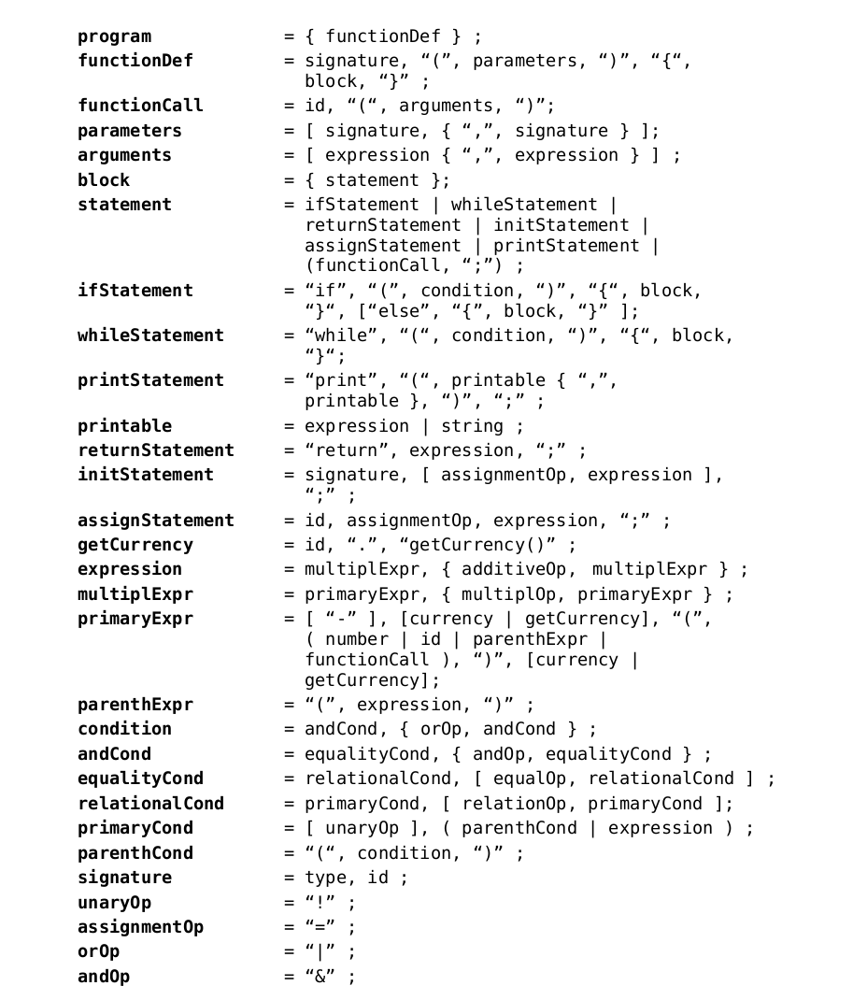
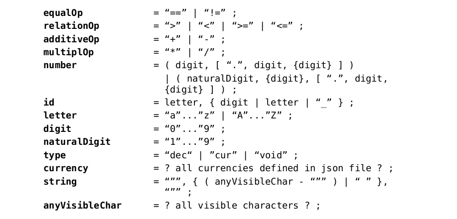

# CurrencyPL
My own programming language with a built-in currency type

## Table of contents
* [Project description](#project-description)
* [Usage](#usage)
* [Elements of the language](#elements-of-the-language)
* [Language details](#language-details)
* [Arithmetic operations](#arithmetic-operations)
* [Logical operations](#logical-operations)
* [Tokens used](#tokens-used)
* [Tests](#tests)
* [Sample program](#sample-program)
* [Grammar](#grammar)


## Project description

Project made for the subject Compilation Techniques at the Warsaw University of Technology.

As part of the project, I created an interpreter of a simplified version of the C language enriched with a built-in currency type, which enables performing basic operations on variables of this type.

### Usage

To run the program written in CurrencyPL:

    python3 currencypl.py <program> <rates>

**program** - path to a text file with the code of the program written in CurrencyPL <br/>
**rates** - path to a json file containing defined currencies with their rates (format below)
    
### Elements of the language:

- currency data type
- numeric data type
- arithmetic operators
- logical operators
- arithmetic, parentheses
- relationship operations (`<`,`>`, `==` etc.)
- an `if-else` conditional statement
- `while` loop
- ability to define functions
- `print()` function that prints out text and values of variables or numbers
- currency conversion methods
- a method that returns the currency assigned to the variable

The interpreter detects errors and informs the user about their occurrence.

### Language details

- The following types are implemented in the language: numeric - `dec `and currency - `cur`.
- The currencies that can be assigned to the currency type variable must be defined in the json format file. Each currency has an exchange rate to convert its value to another currency.
- The program code file must contain one `main` function without arguments. The program execution begins with it.
- Functions can return `dec` and `cur`, or declared as `void` - nothing.
- When initializing a variable without a declared currency type, it is required to specify the currency in which we want to store this variable or it may also result from the result of the expression that will be assigned to this variable, e.g. the sum of two cur variables for EUR will also assign the value of EUR to this variable.
- It is possible to convert a cur variable to another currency by using a currency type token before or after the variable. It is also possible to use two: prefix and postfix. Then the variable will be first converted to the currency defined in the prefix currency and then in the post-fix currency, e.g. expression:
      
        a = eur b usd;
  
    it will convert the variable to EUR first, then USD.
  

- When performing operations on `cur` variables, the result will always be in the resulting currency of the first operand of the operation, e.g. for:
      
      cur sum = eur a + b;
      
  where `a` is in USD and `b` in PLN, the following currency conversion will occur:
  1. `a` will be converted to EUR
  2. `b` will be converted to EUR (resulting currency of the first operand of the action)
  3. The result in EUR will be assigned to the variable `sum`.
 
 
- It is possible to convert whole expressions, e.g .:
      
        cur result = pln (eur a usd + b / 4) chf;

  The principle of operation of prefix and post-fix types of currencies is the same as for variables. 
  

- It is possible to add comments using the "#" token. Then the text from that character to the end of the line is not treated as program code.
- Each function has its scope of variables and a variable of the same name declared in another function is not visible in it.


### Arithmetic operations:

- For numeric type variables, all basic mathematical operations (addition, subtraction, multiplication, division) are allowed.
- It is allowed to add and subtract currency type variables.
- It is allowed to divide and multiply currency type variables by number type variables.
- It is **not** allowed to add or subtract currency type variables to numeric type variables.
- It is **not** allowed to divide and multiply numeric type variables by currency type variables.
- It is **not** allowed to multiply and divide the currency type variables by each other.


### Logical operations:

- When comparing currency type variables, the second operand of the operation is converted to the resulting currency of the first operand.
- It is allowed to compare currency type variables to numeric type variables. Then only their value is compared without taking into account the variable currency.
      
### Tokens used

    "Return", "if", "else", "while", "(", ")", "{", "}", ",", ".", ";", "+", "- "," = "," * "," / "," == ","! = "," & "," | ","> "," <"," <= ","> = ", "!", "Print", "getCurrency", "void", "dec", "cur",

and all currencies defined in the json file.

Sample json file structure (currency rates used are not true values):

```json
{
  "pln": {
      "chf": 1.25,
      "gbd": 2.15,
      "usd": 1.16,
      "eur": 0.15
  },
  "chf": {
      "pln": 5.25,
      "gbd": 3.14,
      "usd": 1.25,
      "eur": 0.27
  },
  "gbd": {
      "pln": 1.19,
      "chf": 5.01,
      "usd": 2.22,
      "eur": 0.18
  },
  "usd": {
      "pln": 0.15,
      "chf": 1.40,
      "gbd": 1.14,
      "eur": 0.62
  },
  "eur": {
      "pln": 1.89,
      "chf": 4.78,
      "gbd": 4.21,
      "usd": 0.58
  }
}
```

### Tests

For testing, I used the _pytest_ tool. The tests consisted of various language usage scenarios and a comparison of the expected results with the actual results of the lexer, parser and interpreter. The tests also take into account the occurrence of errors while writing the program by the user.

### Sample program

```
dec add(dec a, dec b) {

  return a + b;
  
}

void main() {

  cur a = 5 eur;
  cur b = a pln;
  dec counter = 0;
  dec result = 0;
	
  while (counter < 6) {
      if (!result > 50) {
          print("Result is not bigger than 50");
      }
      else {
          print("Result is bigger than 50");
      }
      result = add(10, counter);
      counter = counter + 1;
  }
  
  cur income = a + b usd;
  print("Income in USD is: ", income);
  
}
```

### Grammar

_Written in EBNF notation_




